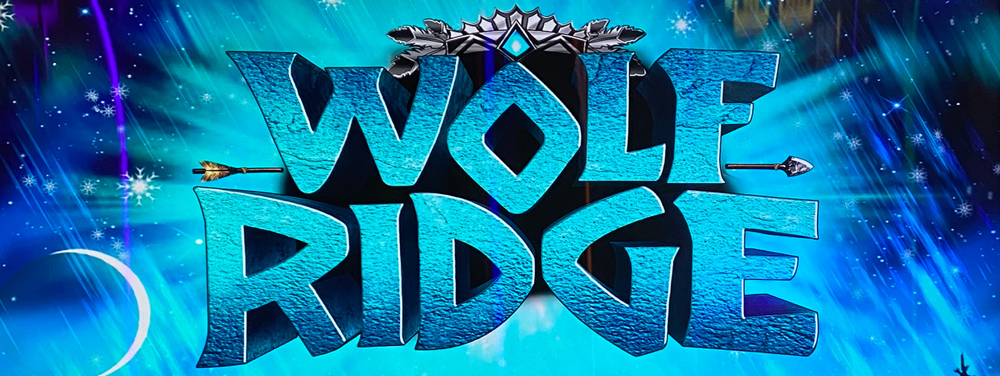
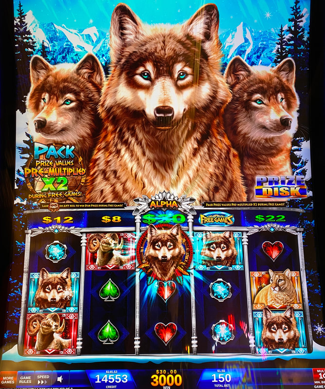
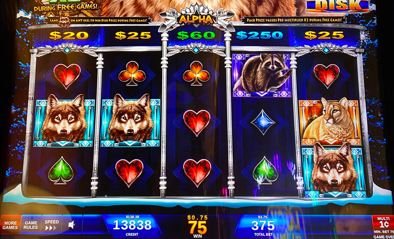
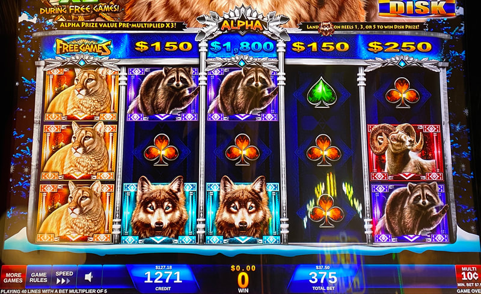

## Thumbnail

## Gameplay Images

### Image 1

### Image 2

### Image 3

**Description:** This is an excellent play. On the next spin, the blue $250 prize will shift into the Alpha reel, where it will get a 3x multiplier, making it a potential win of $750 on a $3.75 bet.

### Image 4

**Description:** This was a $37.50 investment (notice the 10¢ denom) for a chance at an $1,800 win.

## How The Advantage Works

Wolf Ridge features a **Prize Disk** above the reels:

**Mechanic:**
- Prize Disk shifts **left one position** each spin
- Wolf symbol lands in reel 1, 3, or 5 → Win prize above that reel
- Middle reel (Alpha) prizes get <strong>3x</strong> multiplier
- Prize types: Free games, blue credits, green credits, yellow credits

**Prize Value Hierarchy:**
| Prize Type | Value |
|------------|-------|
| Free games | High |
| Blue credits | High |
| Green 50x+ | Worth playing |
| Green below 50x | Skip |
| Yellow | Skip |

---

## PLAY WHEN (ANY ONE)

**Option A — Reel 2 or 4 (1 Spin):**
- Free games, blue prize, or green <strong>50x+</strong> in reel 2 or 4
- Play <strong>1</strong> spin

**Option B — Reels 3 AND 5 (2 Spins):**
- Valuable prizes in **both** reels 3 and 5
- Play <strong>2</strong> spins (2 chances to win on second spin)

**Option C — Alpha Reel Setup:**
- Any green prize in reel 4 → Play <strong>1</strong> spin
- Any blue prize in reel 5 → Play <strong>2</strong> spins (reaches Alpha for 3x)

---

## DO NOT PLAY WHEN

- Prizes only in reel 1 (shift off screen next spin)
- Green prizes below <strong>50x</strong> bet
- Yellow prizes only

---

## STOP WHEN

- Wolf symbol lands and prize collected
- Target prize shifts off left side of screen

---

## COMMON MISTAKES

- Playing reel 1 prizes (shift off screen next spin)
- Playing small green prizes (need 50x+ bet)
- Not recognizing Alpha reel 3x multiplier value

---

## Additional Notes

**Alpha Reel (Reel 3):**
- All prizes get <strong>3x</strong> multiplier
- More important than in similar game Elephant King
- Blue prize reaching Alpha = Big potential win

**Variance:**
- Expect to lose majority of plays
- Wolf symbol difficult to land
- Small investment (1-2 spins)
- Occasional big win covers losses

**Audio Alerts:**
- Soft rumbling = Smaller win incoming
- Loud wolf howl = Big win incoming