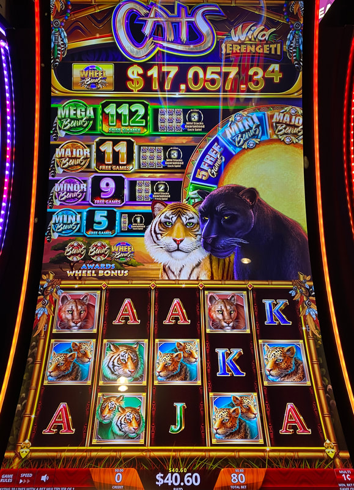
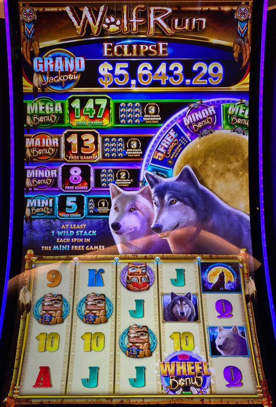
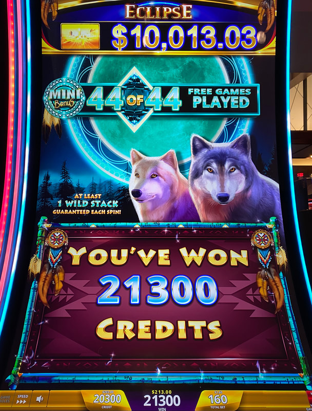

## Thumbnail

## Gameplay Images

### Image 1

### Image 2

**Description:** Cats Wild Serengeti is a newer sister title to Wolf Run Eclipse.

### Image 3

**Description:** The mega might seem high at 147 free games, but it starts at 100. It’s nearly impossible to hit, so I don’t recommend ever directly chasing it.

### Image 4

**Description:** Even the mini can pay very well when the number of free games runs this high.

## How The Advantage Works

Wolf Run Eclipse / Cats Wild Serengeti features **four progressive free games meters** (NOT must-hit-by):

**Meter Types:**
| Meter | Color | Resets To | Wild Reels Per Spin |
|-------|-------|-----------|---------------------|
| Mini | Blue | 5 | 1 full reel |
| Minor | Purple | 5 | 2 full reels |
| Major | Orange | 5 | 3 full reels |
| Mega | Green | 100 | 3 full reels |

**Mechanic:**
- Free games symbol lands in reel 4 → Corresponding meter increases
- Bonus triggered → Win accumulated free games
- Completely random when bonus triggers (NOT must-hit-by)

---

## ⚠️ BANKROLL WARNING

**This is NOT a must-hit-by game.**
- Completely random when bonus triggers
- Only for experienced APs with large bankrolls
- Most common way APs get destroyed

---

## PLAY WHEN

| Meter | Color | Free Games Threshold |
|-------|-------|---------------------|
| Mini | Blue | ≥ <strong>30</strong> |
| Minor | Purple | ≥ <strong>40</strong> |
| Major | Orange | ≥ <strong>65</strong> |
| Mega | Green | ❌ **NEVER** |

**How to Check:**
- Look directly on bet pad
- Shows free games count for all bet levels

---

## DO NOT PLAY WHEN

- Mini below <strong>30</strong> free games
- Minor below <strong>40</strong> free games
- Major below <strong>65</strong> free games
- **NEVER** chase Mega directly
- You are a newer AP with limited bankroll

---

## STOP WHEN

- Free games bonus triggers for targeted meter
- You hit your loss limit (set one before playing)

---

## COMMON MISTAKES

- Chasing Mega (nearly impossible to hit directly)
- Thinking more spins = closer to hitting (NOT TRUE)
- Chasing without adequate bankroll
- Not setting a loss limit before playing

---

## Additional Notes

**Critical Bankroll Warning:**
- "On average" is key—you may not hit in average spins
- Digging deeper hole doesn't mean closer to hitting
- Set a budget you're comfortable losing
- If you don't hit, call it a loss and move on
- Bankroll management is crucially important

**Mega Meter:**
- Resets to <strong>100</strong> free games (not 5)
- View as jackpot, not something to chase
- Extremely difficult to hit
- Pretty much guaranteed handpay when it does

**Wild Reel Behavior:**
- Major/Mega: 3 wild stacks rigged to land towards right

**Game Variants:**
- Wolf Run Eclipse ✅
- Cats Wild Serengeti ✅ (same strategy)