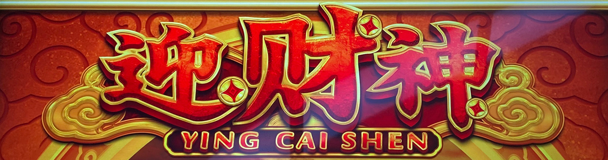
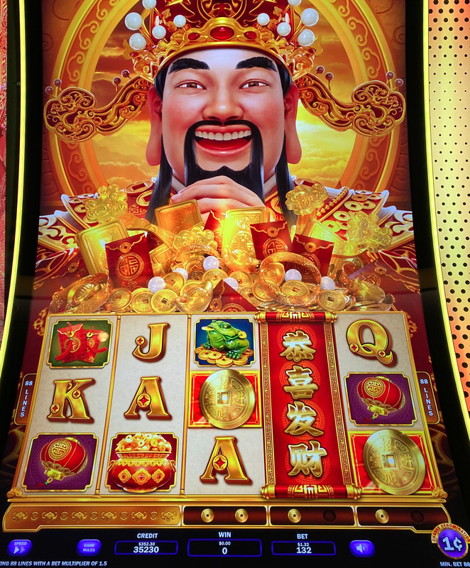

## Thumbnail

## Gameplay Images

### Image 1

### Image 2

**Description:** Reel three will be wild for two more spins, while reel four will be wild for one more spin.

## How The Advantage Works

Ying Cai Shen features **coin holders** below reels 3, 4, and 5 only:

**Mechanic:**
- Coins land below reels 3, 4, 5
- <strong>2</strong> coins fills holder → Reel turns WILD for <strong>2</strong> spins
- Wild reel shows red banner when active

**Active Wild Indicators:**
| State | Coins Below | Banner | Spins Left |
|-------|-------------|--------|------------|
| Not active | 0-1 | No | 0 |
| Active (2 spins) | 2 | Yes (red) | 2 |
| Active (1 spin) | 1 | Yes (red) | 1 |

---

## PLAY WHEN (ANY ONE)

**Option A — Reel 3 Active:**
- Reel 3 has active wild
- (2 coins below OR 1 coin + red banner)

**Option B — Reels 4 AND 5 Active:**
- **Both** reels 4 and 5 have active wilds

**Option C — One-Spin Gamble:**
- Reel 4 active with <strong>2</strong> spins remaining
- AND <strong>1</strong> coin below reel 3
- Play **1 spin only** to try landing 2nd coin in reel 3
- If no coin lands → Stop immediately

---

## DO NOT PLAY WHEN

- Reel 4 or 5 active alone (not both)
- Only 1 coin in reels 3 and 4 (not +EV)
- Active wild about to expire with no coins below

---

## STOP WHEN

- Wild reel(s) expire (banner gone, coins empty)
- One-spin gamble failed (no coin landed in reel 3)

---

## COMMON MISTAKES

- Playing 1 coin in reels 3 and 4 (not +EV)
- Playing single active wild in reel 4 or 5
- Not recognizing active wild indicators (banner + coins)
- Not checking all denominations

---

## Additional Notes

**Limited Advantage:**
- Only reels 3-4-5 have coin holders
- Less valuable than Golden Egypt (all 5 reels)

**Coin Frequency:**
- Coins land frequently
- Common to find active wilds left behind

**Big Wins:**
- 5-of-a-kind main character = Huge payout
- Bonus feature: Frequent but volatile

**Denominations:**
- Multiple denominations available
- Switch directly on bet pad to check all