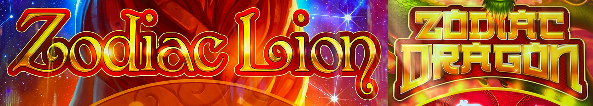
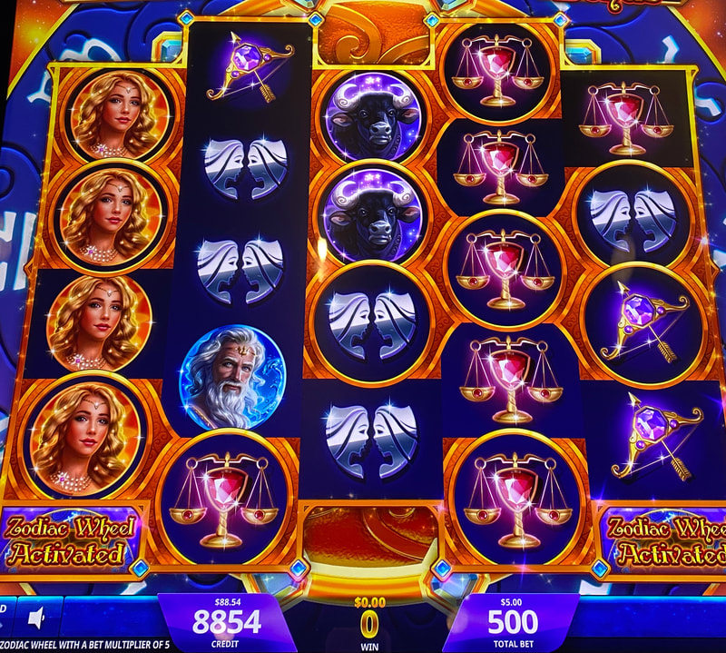
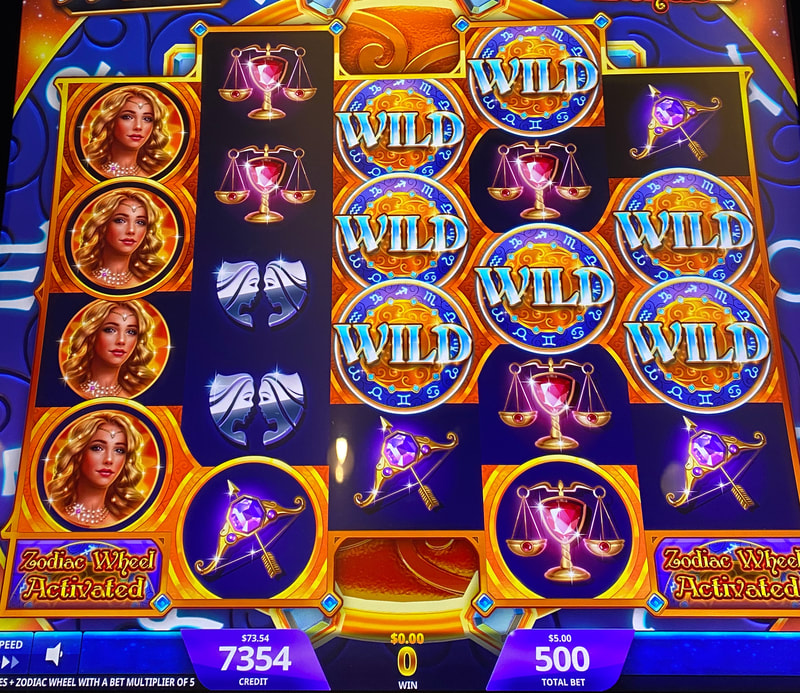
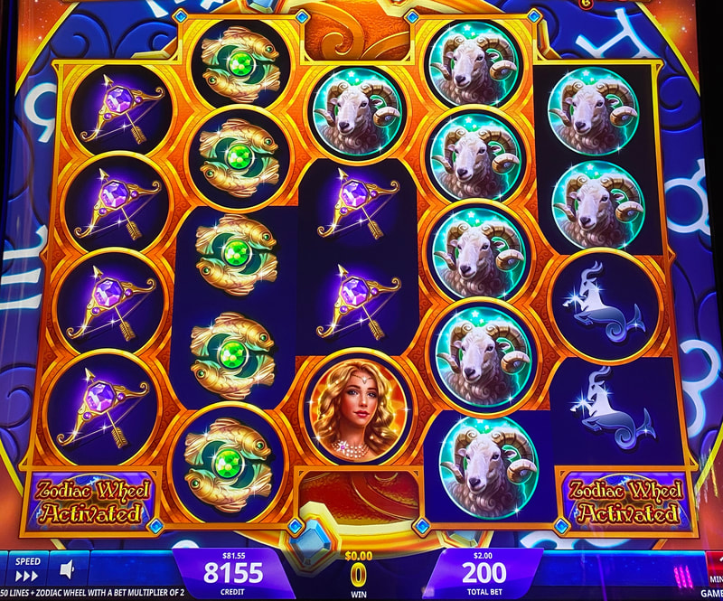
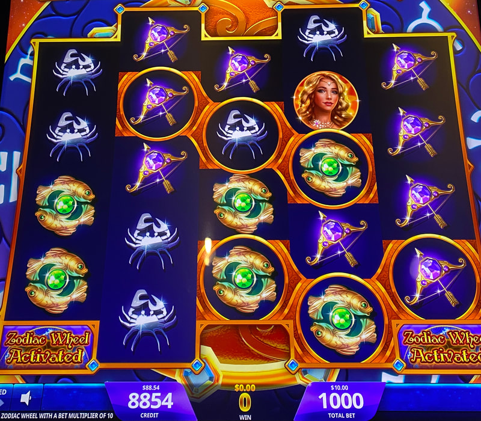
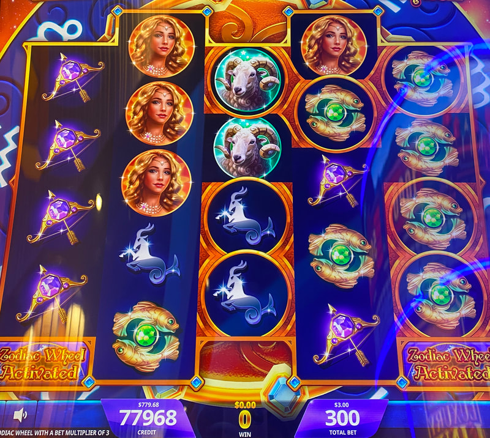
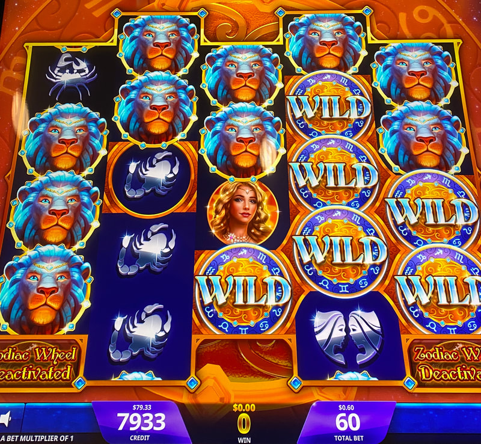
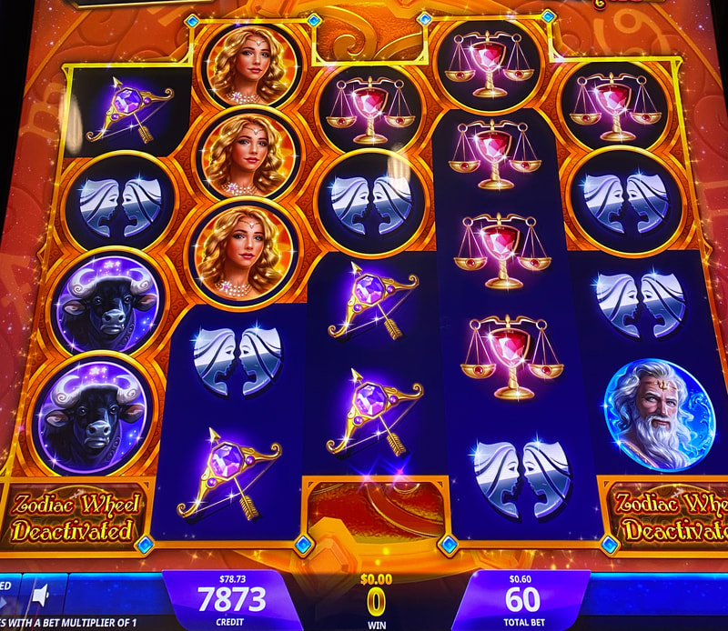
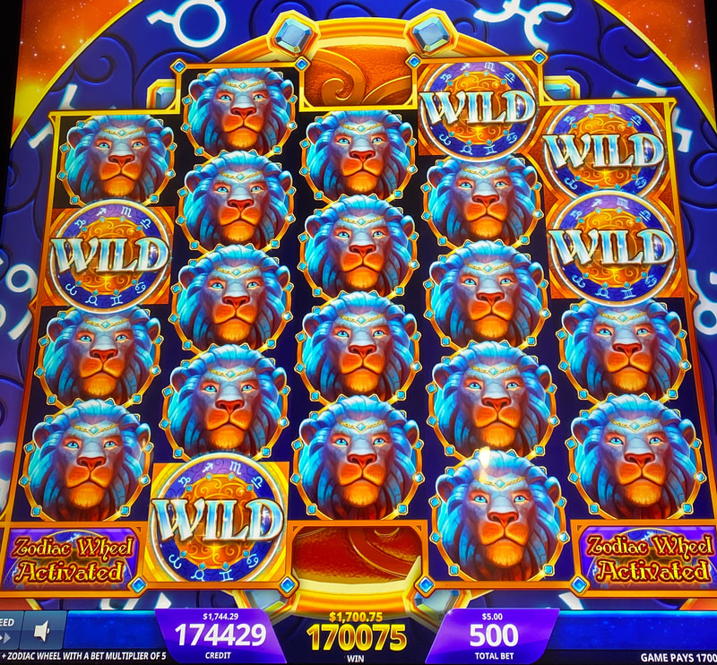
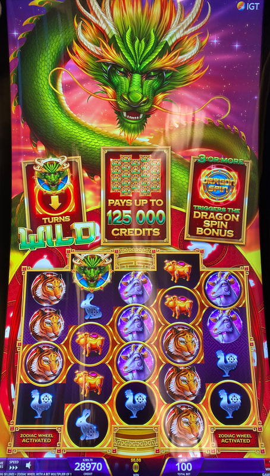

## Thumbnail

## Gameplay Images

### Image 1

### Image 2

**Description:** Attempting to connect gold frames on the left side to gold frames on the right side is risky. Scroll down to see the results of this attempt.

### Image 3

### Image 4

**Description:** I would definitely still play this, but having holes in the middle like this really cut into the payout.

### Image 5

**Description:** I considered playing this but decided to pass. If there was one more gold frame connecting horizontally on either the top or bottom clump, then I would play.

### Image 6

**Description:** Avoid plays like this where the gold frames are concentrated in reels three, four and five.

### Image 7

**Description:** Watch for plays like this that are the result of the previous player cashing out after the Lion Spin Bonus. Scroll down to see what the next spin will look like.

### Image 8

**Description:** The leftover lion heads from the Lion Spin Bonus are now gold frames.

### Image 9

### Image 10

**Description:** Zodiac Dragon isn’t nearly as common as Zodiac Lion, but it plays exactly the same.

## How The Advantage Works

Zodiac Lion / Zodiac Dragon features **persistent gold frames**:

**Mechanic:**
- Lion/dragon head lands → Creates gold frame
- Another head lands IN any frame → All connected frames turn WILD
- Frames disappear next spin after triggered
- Goal: 4-of-a-kind or 5-of-a-kind line hits (3-of-a-kind pays poorly)

---

## PLAY WHEN (ANY ONE)

**Option A — Four Horizontal Frames:**
- <strong>4+</strong> gold frames connected horizontally
- Must span reels 1-4 OR reels 2-5

**Option B — Three Horizontal + Large Clump:**
- <strong>3+</strong> horizontal frames starting in reel 1 or 2
- <strong>8+</strong> total connected frames in that clump

| Horizontal Span | Total Clump | Action |
|-----------------|-------------|--------|
| Reels 1-4 | Any | ✅ **Play** |
| Reels 2-5 | Any | ✅ **Play** |
| Reels 1-3 or 2-4 | 8+ | ✅ **Play** |
| Reels 3-5 only | Any | ❌ Skip |

---

## DO NOT PLAY WHEN

- Frames only in reels 3-4-5 (no connection to reels 1-2)
- Frames connected vertically but not horizontally
- Random scattered frames not connected horizontally

---

## STOP WHEN

- Lion/dragon head lands in gold frame
- All connected frames turn wild
- Frames disappear next spin

---

## COMMON MISTAKES

- Playing any bunch of frames regardless of position (common mistake)
- Playing reels 3-4-5 clumps with no connection to left reels
- Expecting 3-of-a-kind to pay well (need 4+ of a kind)
- Not recognizing horizontal vs vertical connections matter

---

## Additional Notes

**Popular But Poorly Played:**
- One of most popular AP games
- Most hustlers play incorrectly (any frames = play)
- Horizontal connection matters more than frame count

**Lion Spin Bonus Leftovers:**
- After Lion Spin Bonus → Leftover lion heads become frames next spin
- Watch for players cashing out after bonus
- These can be excellent walk-up plays

**Bet Level Strategy:**
- Top row bets (no Zodiac Wheel): Pay better but harder to land heads
- Bottom row bets: Take more chances connecting clumps (wheel can help)
- Even $0.60 bet pays well on 5-of-a-kind wilds

**Game Variants:**
- Zodiac Lion ✅ (common)
- Zodiac Dragon ✅ (plays exactly the same, less common)

**Pro Tip:** Turn down volume before checking

**RTP:** 85% to 96%